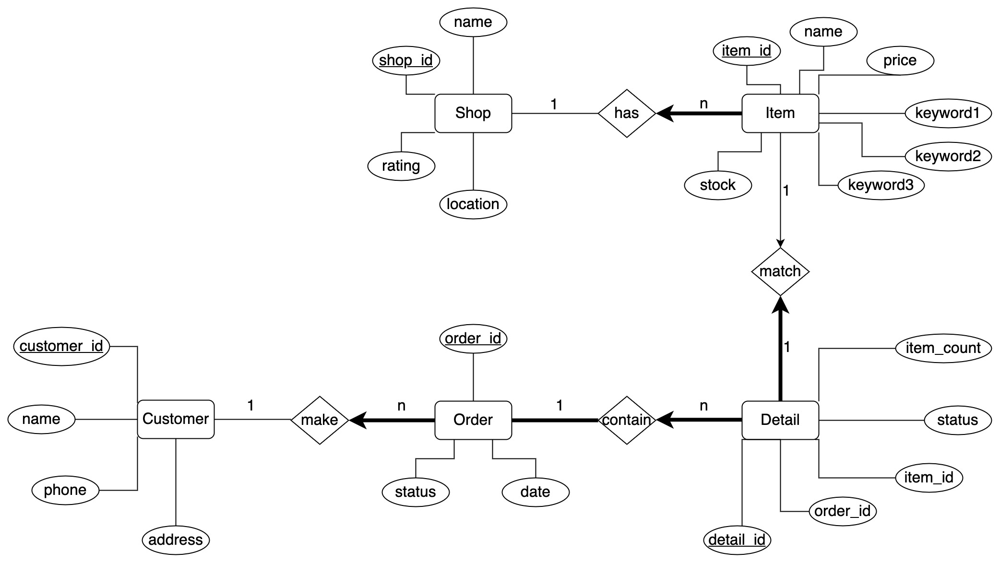

# Retail
In this project, we will design and implement an online retail database application.

## Design ER Diagram


## Initialize Database
You can find sql files under the directory of `db` to initialize the database. You can use docker to run a MySQL server in your local environment. You can refer to [Get Docker](https://docs.docker.com/get-docker/) to learn about how to install Docker.

```
docker run --name mysql -e MYSQL_ROOT_PASSWORD=yourpassword -d mysql
```

## Create a file `config.ini` under the root directory
```
[mysql]
host=
database=
user=
password=
``` 

## How to test functions

### Install dependencies
```
pip install -r requirements.txt
```

### Test whether the connection to MySQL is ok
```
python connect.py
```

### Shop management
```
python shop_query.py

python shop_insert.py
```

### Item management
```
python item_query.py

python item_insert.py
```

### Item search
```
python item_search.py
```

### Item purchase
```
python order_making.py
```

### Order canceling
```
python order_canceling.py
```